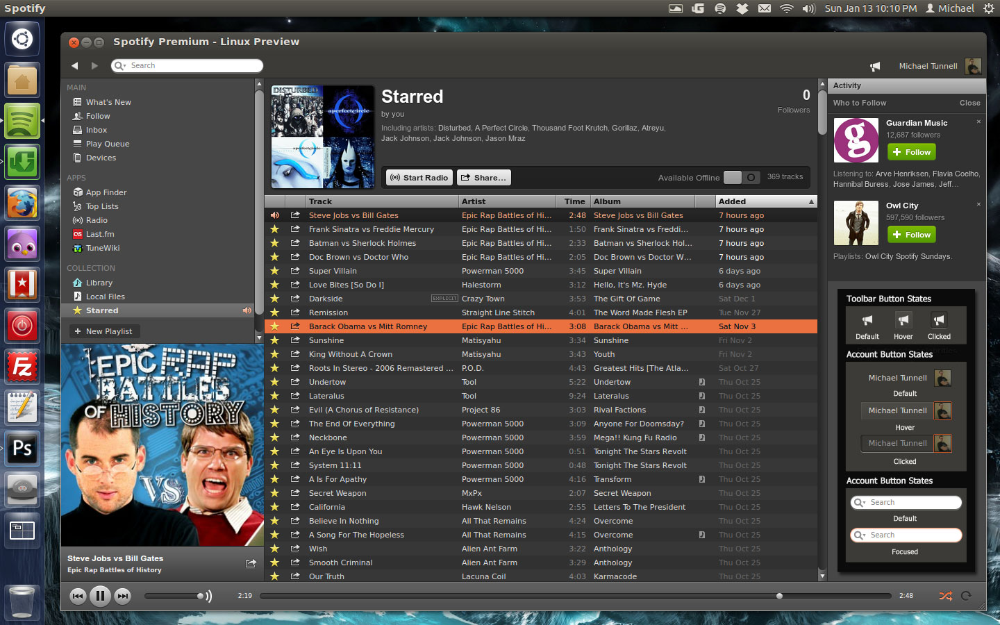

> Important Note: I no longer use Feedly so if errors occur I will not see them, which means if you are using this and notice an issue please let me know so I can fix it...otherwise I won't ever see it and thus won't be fixed.
>
> To inform me of an error please [submit an issue here on GitHub](https://github.com/MichaelTunnell/spotifythemes/issues) or tweet to me [@MichaelTunnell](https://twitter.com/michaeltunnell).

- [Description](#description)
- [Installation](#install)
- [Project Details](#details)

## Spotify Themes for Linux

 Spotify looks nice in general but Linux is all about customization but Spotify clashes a lot with the default theme of Ubuntu (Ambiance) so I decided to customize it to the Ambiance theme. In this blog post you can find the Download file of this open source theme and the instructions on how to install it. The installation takes very little time and is VERY easy to do BUT it does require making changes as Root. (required because of Spotify's structure of the app)

-------------

#### Project Details

Theme Version: 1.3.0

Spotify Version: 0.9.4.183

Ubuntu Versions: 12.04 - 13.10 (should also work on 11.04 and 11.10 but is not supported)

Updated on: 11/15/2013

[RSS Feed](https://github.com/MichaelTunnell/spotifythemes/commits/master.atom)

---------------

#### Installation

*Important Disclaimer:*

Installing this theme requires ROOT actions to be taken because of the way the Spotify app is structured. I wouldn't ask you to use root unless it was necessary, which it is. I am also releasing this theme under my name (not a moniker) because some people might see this as sketchy to require Root but this is not my choice and I hope this eases your concerns because if I was doing something malicious then it would be incredibly stupid to be using my name. :)

*Disclaimer: much less important*

The resources.zip that is being used to modify the interface and tray icon provides a LOT of customization options BUT not everything can be changed with these resources. A few buttons and the blue highlight of the search results popup are declared somewhere other than the resources archive. I suppose I could have just missed it but I spent more time than I should have searching the contents and searching all the code inside of the skin.xml file.

**Installation Instructions:**

Spotify Version Compatibility: 0.9.4.183

The following process explains how to install both the Ambiance theme and the Radiance tray icon.

- Open up Nautilus and navigate to the theme download, extract the downloaded file.
- Inside the archive you will find a file named "resources.zip"...Do NOT extract this...it needs to stay a zip file for Spotify to use it.
- Open a Terminal or press "Alt + F2" to run the command in the Dash.
- Run the following command: gksu nautilus "/opt/spotify/spotify-client/Data"
- The above command will open the "Data" folder located in "/opt/spotify/spotify-client" as Root (sudo), if this for some reason does not work then run gksu nautilus and navigate to "/opt/spotify/spotify-client/Data".
- Inside this folder you will see an existing "resources.zip" file, drag and drop the new archive file to this folder and overwrite the existing file. (or rename the original, if you want to change back later)

That's It. Installation is DONE! (yes, just one simple drag and drop is all it takes...as root, of course.)
