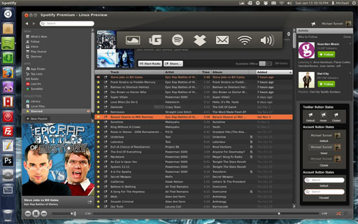

**Theme Details:**

Name: Ubuntu Ambiance for Spotify

Theme Version: 1.3.0

Spotify Version: 0.9.4.183

Ubuntu Versions: 12.04 - 13.10 (should also work on 11.04 and 11.10 but is not supported)

Updated on: 11/15/2013

[Installation Instructions](https://github.com/MichaelTunnell/spotifythemes)

[Download Ubuntu Ambiance Theme](http://sourceforge.net/projects/spotifylinux/files/Ubuntu%20Ambiance/1.3.0%20for%20Spotify%200.9.4.183/ubuntu-ambiance-theme-for-0.9.4.183.zip/download)

*Note*

If you experience any issues with your version of Ubuntu, if you are using one of the 3 supported, then please post a comment at the bottom of this page.

Other Downloads:

Ubuntu Ambiance Theme with Disabled Panel Menu: [Download](http://sourceforge.net/projects/spotifylinux/files/Ubuntu%20Ambiance/1.3.0%20for%20Spotify%200.9.4.183/ubuntu-ambiance-theme-with-panel-menu-disabled-for-0.9.4.183.zip/download)

Use this version if you want to install the Ubuntu Ambiance Theme as display above but want to Disable the Spotify Panel so nothing is shown. This is for people who want to use the Sound Menu instead. This has a small problem because Spotify has a bug that doesn't open the window when closed. You can play, pause, next, and previous from the Sound Menu but you can't reopen the app...for that you need to use the HUD. Alt -> type in "spot" -> choose "Open Spotify"

 

Ubuntu Ambiance Icon with Default Spotify Theme: [Download](http://sourceforge.net/projects/spotifylinux/files/Ubuntu%20Ambiance/1.3.0%20for%20Spotify%200.9.4.183/ubuntu-ambiance-icon-with-default-theme-for-0.9.4.183.zip/download)

Use this version if you want to JUST customize the Spotify Panel Menu to the Ubuntu Ambiance Icon and keep the default theme for the Spotify client.