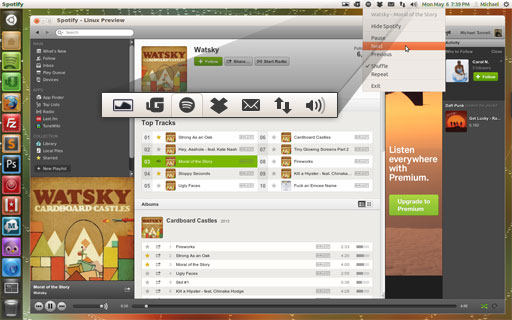

**Theme Details:**

Name: Ubuntu Ambiance for Spotify

Theme Version: 1.3.0

Spotify Version: 0.9.4.183

Ubuntu Versions: 12.04 - 13.10 (should also work on 11.04 and 11.10 but is not supported)

Updated on: 11/15/2013

[Installation Instructions](https://github.com/MichaelTunnell/spotifythemes)

[Download Ubuntu Radiance](http://sourceforge.net/projects/spotifylinux/files/Ubuntu%20Radiance/1.3.0%20for%20Spotify%200.9.4.183/ubuntu-radiance-icon-with-default-theme-for-0.9.4.183.zip/download)

 Disclaimer*:

This download is not a complete theme, it is just a customized icon for the Radiance theme. I will try to get a Radiance theme done as soon as possible but unfortunately creating a theme for Spotify is not easy to do or keep updated. Spotify made that as hard as they possibly could.

*Note*

If you experience any issues with your version of Ubuntu, if you are using one of the 3 supported, then please post a comment at the bottom of this page.

